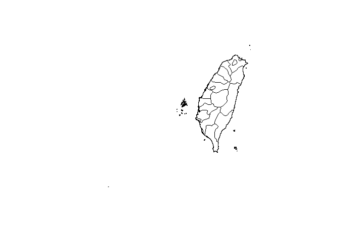

# GIS-in-R--GeoTaiwan

GIS is used to develop and store geographic and attribute data. Geographic analysis which looks at spatial distributions of lands, people and resources and attempts to explain and predict.

## Setup

``` r
x <- c("ggmap", "rgdal", "rgeos", "maptools", "dplyr", "tidyr", "tmap")
lapply(x, library, character.only = TRUE)
```

## Load data

GIS datasets 

``` r
twn <- readOGR(dsn = "C:/Users/USER/Desktop/Spatial task/TWN_adm/TWN_adm2.shp")
```

    ## OGR data source with driver: ESRI Shapefile 
    ## Source: "C:\Users\USER\Desktop\Spatial task\TWN_adm\TWN_adm2.shp", layer: "TWN_adm2"
    ## with 22 features
    ## It has 11 fields
    ## Integer64 fields read as strings:  ID_0 ID_1 ID_2

Plotting Taiwan!
----------------

``` r
plot(twn)
```


Checking the centre of Taiwan
-----------------------------

``` r
twnE <- coordinates(gCentroid(twn))[[1]]
twnN <- coordinates(gCentroid(twn))[[2]]

twnE ; twnN
```

    ## [1] 120.9682

    ## [1] 23.74749

``` r
east <- sapply(coordinates(twn)[,1], function(x) x > twnE)
north <- sapply(coordinates(twn)[,2], function(x) x > twnN)
```

Select zones where
==================

``` r
names(twn)
```

    ##  [1] "ID_0"      "ISO"       "NAME_0"    "ID_1"      "NAME_1"   
    ##  [6] "ID_2"      "NAME_2"    "TYPE_2"    "ENGTYPE_2" "NL_NAME_2"
    ## [11] "VARNAME_2"

``` r
unique(twn$ID_0)
```

    ## [1] 225
    ## Levels: 225

``` r
unique(twn$ID_1)
```

    ## [1] 1 2 3 4
    ## Levels: 1 2 3 4

``` r
unique(twn$ID_2)
```

    ##  [1] 1  2  3  4  5  6  7  8  9  10 11 12 13 14 15 16 17 18 19 20 21 22
    ## Levels: 1 10 11 12 13 14 15 16 17 18 19 2 20 21 22 3 4 5 6 7 8 9

``` r
unique(twn$NAME_0)
```

    ## [1] Taiwan
    ## Levels: Taiwan

``` r
unique(twn$NAME_1)
```

    ## [1] Kaohsiung      Pratas Islands Taipei         Taiwan        
    ## Levels: Kaohsiung Pratas Islands Taipei Taiwan

``` r
unique(twn$NAME_2)
```

    ##  [1] Kaohsiung City <NA>           Taipei City    Changhwa      
    ##  [5] Chiayi         Hsinchu        Hualien        Ilan          
    ##  [9] Kaohsiung      Keelung City   Miaoli         Nantou        
    ## [13] Penghu         Pingtung       Taichung City  Taichung      
    ## [17] Tainan City    Tainan         Taipei         Taitung       
    ## [21] Taoyuan        Yunlin        
    ## 21 Levels: Changhwa Chiayi Hsinchu Hualien Ilan ... Yunlin

``` r
unique(twn$TYPE_2)
```

    ## [1] Chuan-shih     <NA>           District|Hsien Shi           
    ## Levels: Chuan-shih District|Hsien Shi

``` r
unique(twn$ENGTYPE_2)
```

    ## [1] Special Municipality <NA>                 County              
    ## [4] Municipality        
    ## Levels: County Municipality Special Municipality

``` r
unique(twn$NL_NAME_2)
```

    ## [1] <NA>
    ## Levels:

``` r
unique(twn$VARNAME_2)
```

    ##  [1] Gaoxiong Shi            <NA>                   
    ##  [3] Taibei Shi              Zhanghua|Changhua      
    ##  [5] Jiayi|Chiai             Xinzhu                 
    ##  [7] Hualia                  Yilan                  
    ##  [9] Gaoxiong                Jilong Shi|Chilung City
    ## [11] Pingdong                Taizhong Shi           
    ## [13] Taizhong                Tainan Shi             
    ## [15] Taibei                  Taidong                
    ## [17] Yüanlin               
    ## 16 Levels: Gaoxiong Gaoxiong Shi Hualia ... Zhanghua|Changhua

``` r
plot(twn)
plot(twn[twn$ID_2 == 2, ], add = TRUE, col = 'Red')
```



``` r
a <- is.na(twn$NAME_2)
twn$NAME_2[!a]
```

    ##  [1] Kaohsiung City Taipei City    Changhwa       Chiayi        
    ##  [5] Hsinchu        Hualien        Ilan           Kaohsiung     
    ##  [9] Keelung City   Miaoli         Nantou         Penghu        
    ## [13] Pingtung       Taichung City  Taichung       Tainan City   
    ## [17] Tainan         Taipei         Taitung        Taoyuan       
    ## [21] Yunlin        
    ## 21 Levels: Changhwa Chiayi Hsinchu Hualien Ilan ... Yunlin
